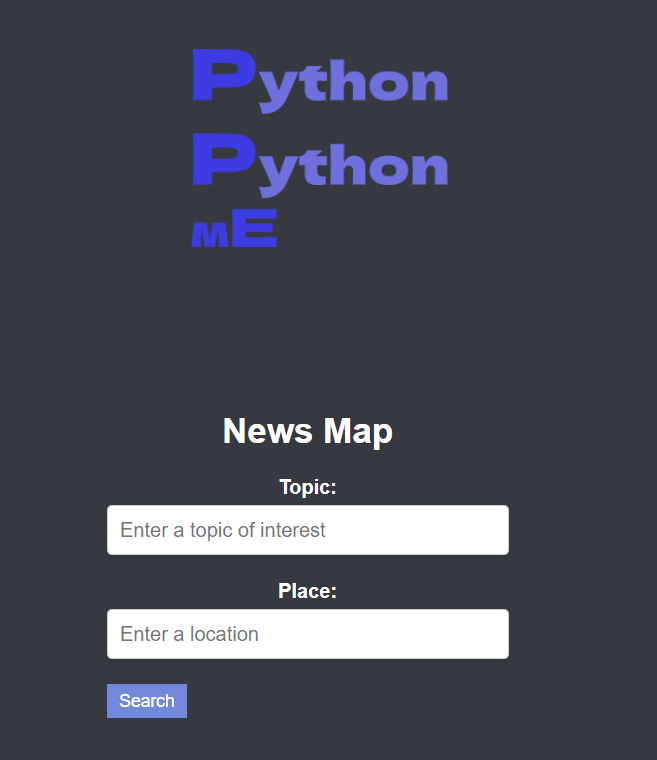
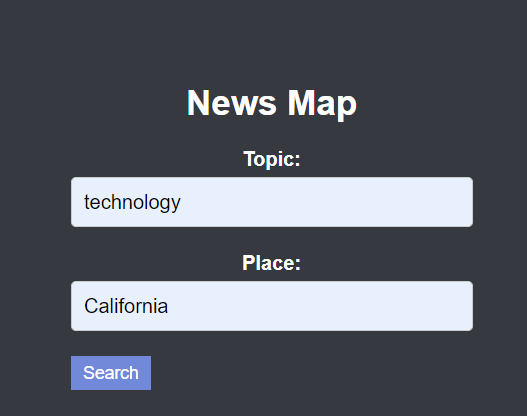

# News Search App

This is a simple web application built with Flask that allows users to search for news articles based on a topic and location.

## Features

- Search for news articles by entering a topic and location.
- Display search results with article title, description, and a link to read more.

## Prerequisites

Before running the application, make sure you have the following installed:

- Python 3
- Flask
- requests library

## Getting Started

1. Clone the repository:

```
git clone <repository-url>
```

2. Install the required dependencies:

```
pip install -r requirements.txt
```

3. Obtain a News API key:

- Sign up for a News API account at [https://newsapi.org/](https://newsapi.org/)
- Copy your API key.

4. Update the API key in `app.py`:

- Open `app.py` in a text editor.
- Replace `''` with your actual News API key in the `search` route.

5. Run the application:
```
python app.py
```

6. Open your web browser and visit [http://localhost:5000](http://localhost:5000) to access the News Search App.

## Usage

1. Enter a topic of interest and a location in the search form on the homepage.
2. Click the "Search" button.
3. The application will fetch news articles related to the provided topic and display them on the results page.
4. Each search result will include the article title, description, and a link to read more.

## Demonstration

* Visiting page



* Searching for 'technology'



* The result page


## Contributing

Contributions are welcome! If you find any issues or have suggestions for improvement, please open an issue or submit a pull request.

## License

This project is licensed under the [MIT License](LICENSE).